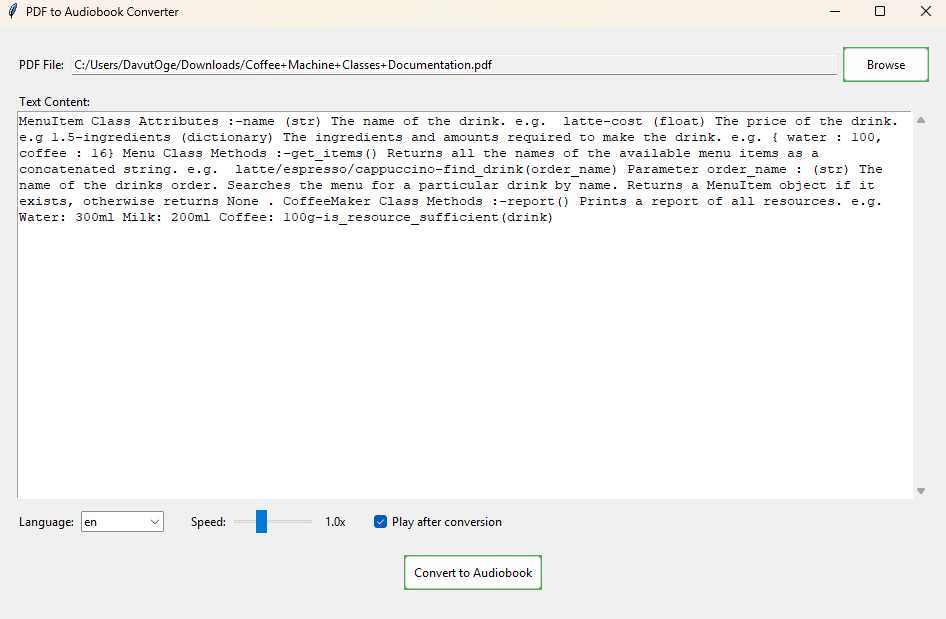

# PDF to Audiobook Converter

This application converts PDF files to audiobooks (MP3 format) using text-to-speech technology. 
It features both a graphical user interface (GUI) and a command-line interface (CLI).


## Features

- Extract text from PDF files (text-based PDFs only, not scanned images)
- Clean and preprocess extracted text
- Convert text to speech using Google's Text-to-Speech (gTTS) API
- Adjust playback speed (0.5x to 2.0x)
- Play the generated audiobook automatically after conversion
- Support for multiple languages
- Edit extracted text before conversion
- Progress tracking during conversion

## Requirements

- Python 3.6 or higher
- FFmpeg (for audio processing) - [Download FFmpeg](https://ffmpeg.org/download.html)

## Installation

1. Clone the repository:
   ```bash
   git clone https://github.com/Davut-oge/text-to-speech.git
   cd text-to-speech
   ```
2. Install the required Python packages:
   ```bash
   pip install -r requirements.txt
   ```
3. Install FFmpeg:
   ```bash
   Windows: Download from here, extract, and add the bin directory to your system PATH.
   macOS: brew install ffmpeg
   Linux: sudo apt install ffmpeg
   ```

## 📂 Usage

1. Run the application:
   ```bash
   python app.py
   ```
2. Use the Browse button to load a PDF file.

3. Select the language you want the audiobook in.

4. Click Convert to Audiobook.

5. Optionally, check "Play Audio" to listen directly.

6. The MP3 file will be saved as audiobook.mp3 in your current directory.

## ⚠️ Warnings

You may see the following warning if ffmpeg is not installed properly:
```bash
RuntimeWarning: Couldn't find ffmpeg or avconv - defaulting to ffmpeg, but may not work
```
✅ To resolve this, download and configure ffmpeg for your system.

## 🖼️ Preview


